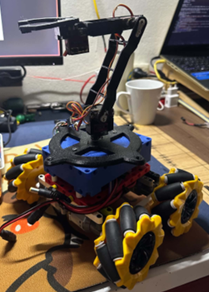
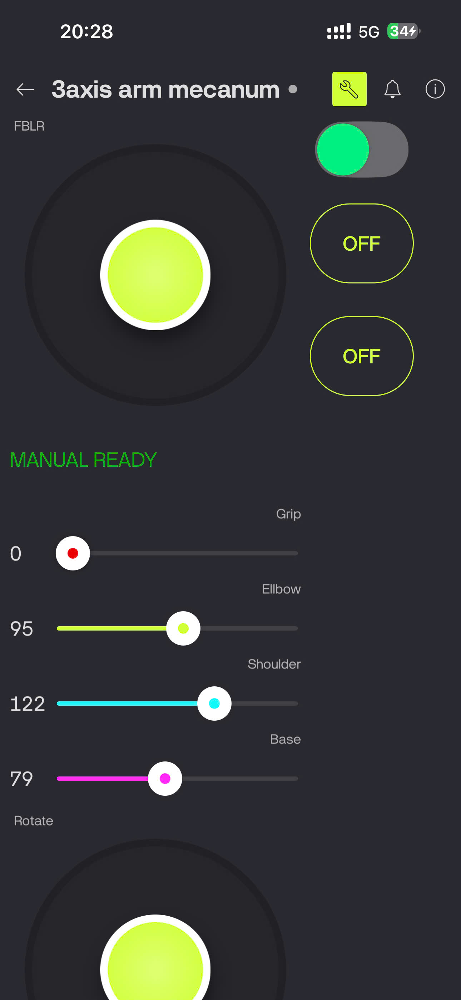

# 🤖 3DOF Mobile Manipulator with Mecanum Wheels & ESP32 Control
<p align="center">
  
</p>

<p align="center">
  <b>3DOF Mobile Manipulator Prototype</b>
</p>

<p align="center">
  
</p>

<p align="center">
  <b>Blynk control</b>
</p>

---

## 🚀 Project Highlights

This project presents the design and implementation of a Mobile Manipulator system combining:

- Omnidirectional Mecanum mobile platform
- 3DOF robotic manipulator
- ESP32 wireless control
- Blynk IoT dashboard
- MATLAB/Simulink validation
- Automated pick-and-place operation

The system is capable of moving in any direction while simultaneously positioning a robotic arm for object manipulation tasks.

---

## 📌 1. Project Overview & Design Context

This project focuses on the research, mechanical design, mathematical modeling, dynamic simulation, and physical prototype implementation of a **Mobile Manipulator** system, which consists of:

1. **Omnidirectional Mobile Platform:** Equipped with 4 Mecanum wheels, allowing 3 degrees of freedom ($v_x, v_y, \omega_z$) movement in the plane without needing to reorient the chassis.
2. **3DOF Serial Robotic Arm:** A serial kinematic chain designed for 3D spatial positioning and automated pick-and-place operation.
3. **Control Architecture & IoT Integration:** An ESP32 microcontroller serves as the main processing unit, communicating over Wi-Fi via Blynk App/Web Dashboard. It interfaces with a PCA9685 PWM driver (I2C) for servo control and dual DRV8833 H-Bridge drivers for DC motors.

---

## 📐 2. Mathematical Modeling & Technical Specifications

### 2.1. 3DOF Manipulator Kinematics (Modified D-H Formulation)

The coordinate frames are established according to the **Modified Denavit-Hartenberg (Modified D-H)** convention:

|      Link ($i$)      | $\alpha_{i-1}$ |             $a_{i-1}$             |         $d_i$         |  $\theta_i$  |        Joint Limits        | Real-World Function                                     |
| :--------------------: | :--------------: | :----------------------------------: | :---------------------: | :------------: | :-------------------------: | :------------------------------------------------------ |
|      **1**      |   $0^\circ$   |                $0$                | $d_1 = 4.0\text{ cm}$ | $\theta_1^*$ | $-90^\circ \to +90^\circ$ | Base Swivel (Base Servo)                                |
|      **2**      |   $90^\circ$   |                $0$                |          $0$          | $\theta_2^*$ |  $0^\circ \to 180^\circ$  | Shoulder Joint (Shoulder Servo)                         |
|      **3**      |   $0^\circ$   |    $a_2 = L_1 = 11.5\text{ cm}$    |          $0$          | $\theta_3^*$ |  $0^\circ \to 180^\circ$  | Elbow Joint (Elbow Servo)                               |
| **End-Effector** |   $0^\circ$   | $a_3 = L_2 + L_3 = 13.5\text{ cm}$ |          $0$          |     $0$     |           Gripper           | Gripper Claw ($L_2=9.5\text{ cm}, L_3=4.0\text{ cm}$) |

* **Forward Kinematics (FK):** End-effector position $P_e = [x_e, y_e, z_e]^T$:

$$
x_e = \cos(\theta_1) \cdot \left[ L_1 \cos(\theta_2) + (L_2 + L_3) \cos(\theta_2 + \theta_3) \right]
$$

$$
y_e = \sin(\theta_1) \cdot \left[ L_1 \cos(\theta_2) + (L_2 + L_3) \cos(\theta_2 + \theta_3) \right]
$$

$$
z_e = d_1 + L_1 \sin(\theta_2) + (L_2 + L_3) \sin(\theta_2 + \theta_3)
$$

* **Inverse Kinematics (IK):**

$$
\theta_1 = \text{atan2}(y, x)
$$

$$
r = \sqrt{x^2 + y^2}, \quad z' = z - d_1, \quad D = \frac{r^2 + z'^2 - L_1^2 - (L_2+L_3)^2}{2 L_1 (L_2+L_3)}
$$

$$
\theta_3 = \text{atan2}\left(\pm\sqrt{1-D^2}, D\right)
$$

$$
\theta_2 = \text{atan2}(z', r) - \text{atan2}\left((L_2+L_3)\sin\theta_3, L_1 + (L_2+L_3)\cos\theta_3\right)
$$

---

### 2.2. Mecanum Platform (Kinematics & Dynamics)

* **Physical Dimensions:**

  * Wheel radius ($r$): $3.25\text{ cm}$
  * Half-length of chassis ($L_x$): $4.75\text{ cm}$ ($2L_x = 9.5\text{ cm}$)
  * Half-width of chassis ($L_y$): $9.50\text{ cm}$ ($2L_y = 19.0\text{ cm}$)
  * Geometric factor: $L_x + L_y = 14.25\text{ cm} = 0.1425\text{ m}$
* **Mecanum Inverse Kinematics:**

$$
\begin{bmatrix} \omega_{FL} \\ \omega_{FR} \\ \omega_{RL} \\ \omega_{RR} \end{bmatrix} = \frac{1}{r} \begin{bmatrix} 1 & -1 & -(L_x + L_y) \\ 1 & 1 & (L_x + L_y) \\ 1 & 1 & -(L_x + L_y) \\ 1 & -1 & (L_x + L_y) \end{bmatrix} \begin{bmatrix} v_x \\ v_y \\ \omega_z \end{bmatrix}
$$

* **Euler-Lagrange Dynamic Model:**

$$
\mathbf{M}(q)\ddot{q} + \mathbf{C}(q, \dot{q})\dot{q} + \mathbf{F}(\dot{q}) = \mathbf{B}\tau
$$

---

## 🛠 3. Block Diagram & Hardware Wiring Schematic


```text
                                +-------------------+
                                |   ESP32 DevKit    |
                                +---------+---------+
                                          |
                +-------------------------+-------------------------+
                | I2C (GPIO21-SDA, GPIO22-SCL)                      | GPIO PWM
                v                                                   v
    +-----------------------+                           +-----------------------+
    | PCA9685 PWM Controller|                           | Dual DRV8833 Drivers  |
    +-----------+-----------+                           +-----------+-----------+
                |                                                   |
  +-------------+-------------+                       +-------------+-------------+
  |             |             |                       |             |             |
CH0:Base     CH1:Shoulder  CH2:Elbow               Motor FL      Motor FR      Motor RL/RR
(MG90S)      (MG90S)       (MG90S)                 (GPIO25/26)   (GPIO27/14)   (GPIO32/33,18/19)
```

## ⚙️ 4. Embedded Firmware & Blynk Communication (`xe_3axis.ino`)

### 4.1. Smooth Control Architecture & Task Timer

The system utilizes non-blocking `BlynkTimer` scheduling:

* **`servoSmoothTask` (20ms):** Interpolates servo angle steps using **$\text{SERVOSTEP} = 2.5^\circ$** to minimize mechanical jerks.
* **`motorRampTask` (20ms):** Accelerates/decelerates motor PWM according to **$\text{MOTORRAMPSTEP} = 12$** to prevent wheel slip and battery voltage drops.

### 4.2. Blynk Virtual Pins Mapping

| **Virtual Pin** | **Function**                | **Value Range / Description** |
| --------------------- | --------------------------------- | ----------------------------------- |
| `V0`                | Auto Pick-and-Place Cycle Trigger | `1`= Start automated sequence     |
| `V1`                | Joystick Controller               | X, Y Axes (**$v_x, v_y$**)  |
| `V2`                | Base Servo Slider                 | **$0^\circ \to 180^\circ$** |
| `V3`                | Shoulder Servo Slider             | **$0^\circ \to 180^\circ$** |
| `V4`                | Elbow Servo Slider                | **$0^\circ \to 180^\circ$** |
| `V5`                | Gripper Servo Slider              | **$0^\circ \to 180^\circ$** |
| `V20`               | Terminal / Status Widget          | System logs & state string          |

### 4.3. Finite State Machine (Auto Pick State Machine)

The automated sequence operates through 9 discrete, timed states:

* **State 0:** Initialization phase, transitions to State 1.
* **State 1 (0ms):** Return arm to Home orientation (**$\text{Base}=140^\circ, \text{Shoulder}=90^\circ, \text{Elbow}=0^\circ, \text{Gripper}=0^\circ$**).
* **State 2 (1200ms):** Chassis moves forward toward target object (`speed = 80`).
* **State 3 (1800ms):** Chassis stops, lowers arm to pick position (**$\text{Base}=90^\circ, \text{Shoulder}=60^\circ, \text{Elbow}=90^\circ$**).
* **State 4 (1500ms):** Close gripper to clamp object (**$\text{Gripper}=50^\circ$**).
* **State 5 (1200ms):** Lift arm to safe transit elevation (**$\text{Shoulder}=100^\circ$**).
* **State 6 (1500ms):** Rotate base to drop target (**$\text{Base}=180^\circ$**).
* **State 7 (1200ms):** Open gripper to release object (**$\text{Gripper}=0^\circ$**).
* **State 8 (1000ms):** Reset arm to Home position, stop chassis, conclude auto cycle, and return to Manual Mode.

## 💻 5. MATLAB / Simulink Verification

The simulation environment in `simulation/QHQD_robot_3dof.slx` includes:

* **Simscape Multibody Model:** 3D physical modeling of the manipulator and Mecanum chassis.
* **FK & IK Validation:** Numerical comparison between mathematical kinematics and Simscape multi-body physics.
* **Trajectory Generation & LQR/PD:** Implementation of position-tracking PD controllers to evaluate dynamic stability.

## 📂 6. Repository Folder Structure

**Plaintext**

```
3dof-mobile-manipulator/
├── firmware/
│   └── xe_3axis.ino             # ESP32 embedded source code (Arduino C++)
├── simulation/
│   └── QHQD_robot_3dof.slx      # Simulink multi-body simulation model
├── media/
│   ├── picture1-7.png       
│   └── Video_2026-03-18_094628  # Demonstration video
├── .gitignore                   # Git build exclusion file
└── README.md                    # Repository documentation
```

---

## 💌 Acknowledgements & Project Context

> **Course Project Report (PBL5):** Advanced Robotic System Design
> **Topic:** *"Design and Control of an Omnidirectional Mobile Robot with an Integrated 3DOF Robotic Arm"* > **Institution:** Danang University of Technology (DUT) | Project-Based Learning Program (PFIEV)
>
> We would like to express our deepest gratitude to **Assoc. Prof. Dr. Vo Nhu Thanh** — our academic advisor, for his invaluable guidance, strategic insights, and continuous technical support throughout the entire duration of this research, ranging from theoretical modeling and MATLAB/Simulink simulation to experimental hardware implementation.
>
> ### 👥 Project Team Members (Group PBL5 - Class 21PFIEV2)
>
> | Full Name                       |
> | :------------------------------ |
> | **Vo Uyen Thu**           |
> | **Truong Toan Minh Nhat** |
> | **Nguyen Huu Hiep**       |
>
> *Danang, Vietnam — 2026.*

---

## 🔬 7. Current Limitations & Future Work

* **Limitations:** The mobile base operates in an **Open-loop** configuration due to the absence of wheel encoders and IMU feedback (MPU6050).
* **Future Work:** Integrate quadrature encoders and 6-DOF IMU sensors for **Closed-loop PID/LQR** motion tracking; Implement computer vision (OpenCV/ROS2) for autonomous object detection and grasping.

## 📚 8. References

[1] M. W. Spong, S. Hutchinson, and M. Vidyasagar,  *Robot Modeling and Control* , Wiley, 2006.

[2] J. J. Craig,  *Introduction to Robotics: Mechanics and Control* , 4th ed., Pearson, 2018.

[3] B. Siciliano, L. Sciavicco, L. Villani, and G. Oriolo,  *Robotics: Modelling, Planning and Control* , Springer, 2009.

[4] P. Corke,  *Robotics, Vision and Control: Fundamental Algorithms in MATLAB* , 2nd ed., Springer, 2017.

[5] K. M. Lynch and F. C. Park,  *Modern Robotics: Mechanics, Planning, and Control* , Cambridge University Press, 2017.

[6] B. E. Ilon, "Wheels for a course stable selfpropelling vehicle movable in any desired direction on the ground or some other base," U.S. Patent 3 876 255, 1975.

[7] Espressif Systems,  *ESP32-WROOM-32 Datasheet* , Technical Reference Manual.

[8] NXP Semiconductors,  *PCA9685: 16-channel, 12-bit PWM Fm+ I2C-bus LED controller* , Product Data Sheet.
